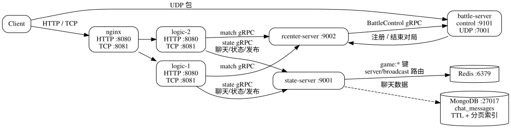

# 🚀 游戏服务端

[](https://go.dev/)
[](https://isocpp.org/)
[](https://grpc.io/)
[](https://docs.docker.com/compose/)
[](https://prometheus.io/)

本仓库是一个本地开发用的多人动作游戏服务端。Go 服务负责局外大厅，C++ `battle-server` 负责局内战斗。客户端通过 HTTP 完成注册登录，通过原生 TCP 操作大厅，并通过 UDP 参与战斗。

当前实现包含账号、好友、在线状态、局外成长、单人对局、双人匹配、世界聊天、好友私聊、聊天历史分页、实时聊天推送、单人/双人通关时间榜、累计击杀榜、四种初始英雄、房间图战斗、升级祝福、结算奖励，以及断线重连和无人房间清理。

## ✨ 核心特性

| 方向 | 当前实现 |
| --- | --- |
| 分层架构 | `logic-server`、`state-server`、`rcenter-server` 和 C++ `battle-server` 按职责拆分，状态访问、匹配调度和战斗模拟边界清晰。 |
| 多协议链路 | HTTP 承载认证入口，TCP 承载大厅长连接，UDP 承载局内实时交互，gRPC + protobuf 负责服务间通信和契约管理。 |
| 连接管理 | 覆盖 TCP 认证、连接替换、心跳、登出、UDP conversation、端点重绑、断线检测、重连和超时清理。 |
| 实时系统 | Redis 路由区分 `server` 定向投递和 `broadcast` 全局广播，`RealtimeDelivery` 统一封装路由与事件，支持跨 logic 实例转发。 |
| 聊天与持久化 | 世界聊天和好友私聊支持幂等写入、昵称下发、历史分页、容量裁剪、TTL 过期和 MongoDB 索引查询。 |
| 排行榜 | 单人和双人通关时间分榜记录纯战斗时间，累计击杀榜跨模式统计；结算与金币发放在同一 Redis 事务中幂等完成。 |
| 战斗运行时 | C++20 ECS 使用固定系统顺序，BattleRuntime 负责房间生命周期、固定频率 Tick、快照广播、结算回调和无人房间回收。 |
| 房间与场景 | 房间图和布局定义玩家出生点、怪物、静态障碍物与陷阱；尖刺、毒池和沼泽均会作用于玩家和怪物。 |
| 玩法数值 | 局内基础数值集中在 `battle-server/gameplay/gameplay_config.hpp`，祝福等级公式从该文件读取基础配置。 |
| 可观测性 | Go 使用统一结构化日志和 Prometheus 指标，C++ 使用 spdlog 和 Prometheus 指标；日志关注已发生事件，指标关注当前负载和趋势。 |
| 工程化验证 | Go 与 C++ 分别维护单元测试和服务测试，协议从 `proto/` 生成，Docker Compose 提供完整依赖和 Prometheus 抓取环境。 |

详细设计见 [架构文档](docs/architecture.md)、[接口文档](docs/api.md)、[指标文档](docs/metrics.md) 和 [Battle ECS 设计](battle-server/ecs/design.md)。

## 🧩 技术架构



局外请求从 Nginx 进入 `logic-server`，由 `state-server` 负责持久化状态，由 `rcenter-server` 负责匹配和战斗节点调度；匹配完成后，客户端切换到 C++ `battle-server` 的 UDP 战斗链路。详细数据流见 [架构文档](docs/architecture.md)。

## 🚀 快速开始

默认使用 Docker Compose 启动完整服务，不要求本地安装 Go 或 C++ 运行时。

首次启动前创建本机局域网配置，再通过增量部署脚本构建并启动全部服务：

```bash
cp .env.example .env
./scripts/compose_up.sh
```

之后修改业务代码时仍然执行同一条命令。脚本使用 `Dockerfile.battle-deps` 的内容哈希标识依赖镜像：对应镜像存在时，Compose 的默认构建图不会包含 `battle-deps`；修改依赖 Dockerfile 或删除依赖镜像后，脚本才会先重新构建 gRPC/Protobuf。业务源码变化不会改变依赖哈希。

将 `.env` 中的 `SERVER_LAN_IP` 设置为运行服务器主机的局域网 IPv4 地址。Compose 后续会自动读取该配置，这个地址会随匹配结果下发给客户端：

```dotenv
SERVER_LAN_IP=192.168.94.115
```

健康检查：

```bash
curl http://localhost:8080/health
```

查看容器状态和日志：

```bash
docker compose ps
docker compose logs -f nginx logic-1 logic-2
```

查看 Prometheus 指标：

```bash
curl http://localhost:9090/api/v1/targets
curl http://localhost:9090/api/v1/query?query=game_battle_active_rooms
```

Prometheus 从所有 Go 服务和两个 Battle 节点的 `:9200/metrics` 抓取指标。指标名称、标签和常用查询见 [docs/metrics.md](docs/metrics.md)。

停止服务但保留 Redis 和 MongoDB 数据卷：

```bash
docker compose down
```

本机客户端通过 `http://localhost:8080` 注册或登录，局域网客户端使用 `http://<SERVER_LAN_IP>:8080`；取得 token 后再连接对应主机的
TCP `:8081`，首帧完成认证，其余大厅操作（包括好友和聊天）均使用 TCP protobuf。logic-server 不直接访问存储，而是通过 state gRPC
读写玩家状态和聊天历史，并订阅本实例的 `server` 路由及全局 `broadcast` 路由。battle-server 分别在 UDP `:7001` 和 `:7002`
上接受客户端包，并将 Compose 中 `SERVER_LAN_IP` 生成的 UDP 地址随匹配结果下发。

局域网客户端需要能够访问服务器主机的 TCP `8080`、`8081` 和 UDP `7001`、`7002` 端口。若 Docker Engine 运行在 WSL2 的 NAT
网络中，还需要在 WSL/Windows 防火墙中放行这些端口，或启用 WSL mirrored networking；`172.29.*` 的 WSL 内部地址通常不能直接作为局域网客户端地址。
在服务器主机的管理员 PowerShell 中执行以下脚本，可一次性添加仅允许本地子网访问的 Windows 防火墙规则：

```powershell
powershell -ExecutionPolicy Bypass -File .\scripts\configure_lan_firewall.ps1
```

## 🔌 服务与端口

| 服务                    | 对宿主机暴露                   | 职责                                 |
|-----------------------|--------------------------|------------------------------------|
| `nginx`               | HTTP `:8080`、TCP `:8081` | 客户端入口，分别转发 HTTP API 和局外实时连接        |
| `logic-1`、`logic-2`   | 否                        | HTTP 注册登录、TCP 认证、好友、在线状态、局外成长、聊天、排行榜和匹配入口 |
| `state`               | 否                        | Go 侧状态服务，唯一直接访问 Redis 与 MongoDB 的业务进程；持久化排行榜 |
| `rcenter`             | 否                        | battle 节点注册、匹配队列、活跃对局与结算           |
| `battle-1`、`battle-2` | UDP `:7001`、`:7002`      | 房间、UDP 会话、战斗 tick、ECS 和快照广播        |
| Redis                 | 否                        | 账号、玩家、会话、好友、在线状态、成长、排行榜与实时事件路由   |
| MongoDB               | 否                        | `chat_messages` 聊天消息持久化；TTL 和频道索引由 state-server 启动时创建 |

## 📦 环境要求

- Linux Docker Engine 与 Docker Compose plugin
- 本地运行 Go 测试需要 Go 1.26.5
- 本地构建 Battle 需要 CMake、C++20 工具链和 protobuf/gRPC 依赖

## 🧪 常用命令

```bash
# Go 全量测试
go test ./...

# 构建并运行 C++ 测试（需要本地 C++ 工具链）
cmake --build battle-server/cmake-build-release-wsl
ctest --test-dir battle-server/cmake-build-release-wsl --output-on-failure

# 重新生成 Go 与 C++ protobuf 代码
bash scripts/generate_proto.sh

# 清除本项目的 Redis 键和 MongoDB 业务库
bash scripts/reset_storage.sh

# 生成统一的 Go、C++ 和 Markdown HTML 文档
bash scripts/generate_docs.sh
```

## 💬 核心行为

- 世界聊天消息写入 MongoDB 后通过 `broadcast` 路由发送到所有 logic-server；每个实例再广播给本机在线连接，发送者通过请求响应看到自己的消息。
- 私聊消息只允许好友之间发送，写入 MongoDB 后按目标玩家所在 logic-server 投递到 `server` 路由；发送者收到 `chat_sent`，接收者收到 `chat_message_pushed`。
- 聊天历史按频道分页读取。服务端返回一页按时间升序排列的消息，使用最早消息的 `message_key` 作为 `before_message_key` 可继续读取更早记录。
- 每条聊天消息携带 `sender_nickname`，客户端无需根据玩家 ID 再查询昵称。
- `match_start` 可选择立即创建单人房间或进入双人 FIFO 队列；成功后 rcenter 为每个玩家保存活跃对局信息，TCP 完成认证和 `match_resume` 都可恢复该信息。
- 单人和双人通关时间分别排名，双人榜以两名玩家组成的队伍为条目；累计击杀榜合并单人和双人数据。通关时间只累计 `Fighting` 阶段，选择祝福的时间不计入。
- 胜利局用更短时间更新通关榜，胜利和失败局都会累加总击杀；排行榜更新与金币奖励共享房间名幂等结算。
- battle-server 在 UDP `hello` 时允许同一玩家重绑到新的会话与端点。
- 连续 15 秒未收到有效 UDP 心跳或输入的会话会标记为断开；所有玩家均断开后，房间等待 90 秒后以 `all_players_disconnected` 原因结束并释放玩家。
- 正常胜利或失败会结算击杀奖励；断线超时结束只释放玩家，不发放奖励。
- 切换房间时统一销毁旧房间的障碍物和陷阱，并按新布局重建；障碍物阻挡角色，陷阱保持可通行。
- 尖刺在目标进入时造成一次伤害，离开后重新进入可再次触发；毒池刷新单个持续伤害状态但不叠层；沼泽降低普通移动和怪物移动速度，但不削弱玩家冲刺。

## 📚 文档导航

| 内容 | 文档 |
| --- | --- |
| 服务与战斗架构、数据流、生命周期 | [docs/architecture.md](docs/architecture.md) |
| HTTP、TCP、聊天和 UDP 协议 | [docs/api.md](docs/api.md) |
| Prometheus 指标和 PromQL | [docs/metrics.md](docs/metrics.md) |
| Battle ECS 组件、系统和 Tick 顺序 | [battle-server/ecs/design.md](battle-server/ecs/design.md) |
| 生成后的 Go/C++ API 文档 | 运行 `bash scripts/generate_docs.sh` 后查看 `docs/site/html/index.html` |
