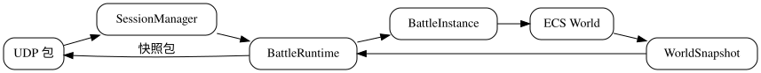
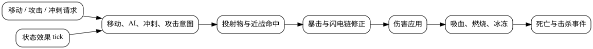
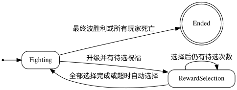

# 战斗 ECS 设计

`battle-server/ecs` 是局内模拟层。它不处理 HTTP、TCP、玩家账号或 Redis；`runtime` 将网络输入转为 `PlayerCommand`，驱动 `World::tick`，再将 snapshot 转为 UDP protobuf。

聊天、好友和实时投递属于局外 Go 服务边界，不进入 ECS 或 battle runtime。聊天历史由 state-server 写入 MongoDB；logic-server 通过 TCP protobuf 提供聊天请求，并消费 `RealtimeDelivery` 后向客户端推送 `chat_message_pushed`。因此战斗房间、ECS 世界和聊天频道彼此独立，战斗断线或房间销毁不会改变聊天历史的 TTL 与分页规则。

## 核心边界



- `net` 负责包收发与编解码。
- `session` 校验 player、room、token 并维护 UDP endpoint、conversation 和连接状态。
- `runtime` 维护房间 tick、广播、结束与 rcenter 回调。
- `BattleInstance` 持有一局的 World、房间流程、静态场景实体、经验、祝福候选和结算统计。
- `World` 只处理实体、组件、系统和事件。

## 实体与组件

实体使用整数 ID。组件池采用 sparse-set 风格的紧凑存储：每个池维护实体 dense 数组、组件 dense 数组和 entity-to-index sparse 索引；删除使用 swap-remove。

### 角色与移动

| 组件 | 主要字段 | 用途 |
| --- | --- | --- |
| `Transform` | position、direction | 位置和朝向 |
| `Velocity` | x、y | 当前移动速度 |
| `MoveRequest`、`MoveIntent` | x、y | 客户端移动请求与归一化后的移动向量 |
| `CharacterStats` | move_speed | 移速 |
| `PlayerController` | 标记组件 | 玩家实体身份 |
| `MonsterController`、`MonsterIdentity` | kind | 怪物身份和种类 |
| `KitingAI` | retreat_distance | 远程怪物的拉开距离规则 |

### 战斗

| 组件 | 主要字段 | 用途 |
| --- | --- | --- |
| `Health` | current_health、max_health | 生命和死亡判定 |
| `AttackDefinition` | kind、damage、range、cooldown、projectile 参数 | 英雄或怪物基础攻击 |
| `AttackRequest`、`AttackState` | requested、阶段、攻击上下文、投射物首帧状态 | 输入、攻击时间轴与投射物生成；攻击不使用独立意图组件 |
| `AttackCooldown` | remaining_seconds | 攻击冷却 |
| `Dash`、`DashIntent`、`DashCooldown` | 倍率、剩余时间 | 冲刺规则 |
| `Projectile` | damage、distance、hit_radius、context | 投射物状态 |
| `StatusEffects` | burns、freeze、poison、swamp | 燃烧、冰冻、毒池持续伤害和沼泽减速状态 |

### 场景与碰撞

| 组件 | 主要字段 | 用途 |
| --- | --- | --- |
| `Collider` | shape、radius、category、collision_mask | 权威碰撞半径、类别和交互掩码 |
| `Trap` | kind、active_targets | 陷阱类型和上一 tick 的范围内目标 |

障碍物使用圆形碰撞体阻挡玩家和怪物。陷阱也有圆形范围，但保持可通行，只用于检测进入或持续停留。

攻击请求由 `AttackRequest` 直接进入 `attack_resolve_system`，再由 `AttackState` 保存权威动作阶段；当前没有独立的 `AttackIntent` 组件。攻击上下文携带 owner、emitter、action state 和 effect ID，用于保证一轮攻击内的闪电链等 proc 不重复触发。

### 成长与祝福

| 组件 | 用途 |
| --- | --- |
| `PlayerProgress` | 局内等级、经验、升级阈值、未选择的祝福次数 |
| `BlessingInventory` | 已持有祝福和等级 |
| `StatusEffects` | 燃烧、冰冻等由祝福触发的持续状态 |

局外成长不是 ECS 组件。`BattleInstance` 在创建玩家前对英雄基础属性调用 `apply_growth`，然后将结果写入角色的 `Health`、`CharacterStats` 和 `AttackDefinition`。

## 固定系统顺序

`World` 构造时注册以下系统，顺序不可随意调换：

```text
move_resolve_system
status_effect_system
monster_ai_system
dash_resolve_system
dash_system
move_system
trap_system
projectile_hit_system
projectile_range_system
attack_resolve_system
projectile_spawn_system
hit_resolve_system
damage_modify_system
pre_damage_blessing_system
damage_system
blessing_trigger_system
death_system
```

冲刺优先沿当前移动输入方向施加；玩家没有移动输入时，则沿 `Transform.direction` 保存的最后朝向施加。



关键规则：

- `status_effect_system` 在本 tick 早期推进燃烧、冰冻、毒伤和沼泽状态；冰冻会影响后续怪物 AI 和攻击。
- `trap_system` 在移动结算后检测角色的新位置。尖刺按进入触发，毒池和沼泽刷新单实例状态；沼泽不影响已经单独结算的玩家冲刺。
- `damage_modify_system` 处理暴击；`pre_damage_blessing_system` 在伤害落地前生成闪电链伤害事件。
- `damage_system` 产生实际伤害和 `DamageAppliedEvent`；随后 `blessing_trigger_system` 处理吸血、燃烧和冰冻。
- `death_system` 消费致死事件，移除实体并生成 kill/death 事件。

## 伤害与事件

伤害以事件形式在系统间传递：

```text
AttackState / Projectile
  -> DamageEvent
  -> modified_damage
  -> DamageAppliedEvent
  -> KillEvent / DeathEvent
```

`DamageSourceKind` 区分普通攻击、燃烧、闪电链和陷阱。吸血只响应攻击伤害。燃烧命中会追加独立 `BurnStatus`，因此同一目标允许按当前机制叠层。冻结保留较长的现有剩余时间。

尖刺对进入范围的玩家或怪物生成一次陷阱伤害事件；目标持续停留时不重复触发，离开后再次进入可重新触发。毒池对每个目标只维护一个 `PoisonStatus`，持续停留只刷新有效期，不叠层也不重置 tick 计时；离开毒池后，状态会继续造成伤害直至过期。沼泽同样刷新单个短时状态，离开后自动过期。

## 房间、升级与祝福

当前阶段已经打通战斗房、奖励房和 Boss 房的局内流程。战斗房完成战斗、经验升级和祝福选择后选择出口；奖励房使用独立免费奖励与商店流程，然后进入出口选择；Boss 房作为最终房间直接进入胜利结算，不再进入出口选择。所有玩家死亡后进入失败。

`DungeonRoomGraph` 定义房间连接和起始房间，`RoomLayoutCatalog` 定义玩家出生点、怪物出生点、障碍物和陷阱。`RoomRuntime` 按以下阶段推进：

```text
战斗房：EnteringRoom -> Fighting -> RoomCleared -> ChoosingBlessing -> ChoosingExit -> Transitioning
奖励房：EnteringRoom -> Rewarding -> ChoosingExit -> Transitioning
Boss 房：EnteringRoom -> Fighting -> Victory
```

进入房间时，`BattleInstance` 根据布局创建怪物、障碍物和陷阱；切房时先销毁旧房间的静态实体，再按新布局重建。重建过程失败会恢复旧地图、静态实体和玩家位置，避免房间状态只更新了一半。战斗房击杀按怪物种类授予经验和灵魂，升级会增加待选择次数，清空房间后进入祝福选择：



每名需要选择的玩家会得到 3 个不同祝福候选。候选被选择后，`BlessingInventory` 中对应祝福新增或升一级。祝福状态与候选会被写入 `WorldSnapshot`，客户端据此显示数值说明和选择 UI。

奖励房不生成怪物，每名存活玩家只能完成一次免费奖励：恢复 50% 最大生命、攻击 `+20`、护甲 `+20`、随机获得或升级一个祝福，或者跳过。所有人完成后进入出口选择。`Rewarding` 和 `ChoosingExit` 均推进 World，因而仍接受移动、攻击和冲刺；布局中的水泉、商店分别通过 `reward_fountain`、`shop` 场景对象类型同步。Boss 房则只生成一个 Boss 与布局实体，房间清空条件由 Boss 死亡单独驱动。

近战和远程怪物分别产出 10 和 5 灵魂。灵魂仅在当局使用，并在所有房间阶段写入快照。奖励房商店可在 `Rewarding` 和 `ChoosingExit` 购买装备；每名玩家对每件装备限购一次，不同玩家可各自购买相同商品。

局内基础数值集中在 `gameplay/gameplay_config.hpp`。`ecs/system/blessing_config.hpp` 只负责根据等级计算最终祝福效果，其基础数值引用统一配置：

| 祝福 | 1 级 | 每级增加 |
| --- | --- | --- |
| 暴击 | 15% 概率，175% 伤害 | 概率 +4%，伤害 +15% |
| 吸血 | 8% | +2% |
| 燃烧 | 6 伤害/秒，2.5 秒 | +2 伤害/秒，+0.5 秒 |
| 冰冻 | 15% 概率，1.0 秒 | 概率 +4%，时长 +0.15 秒 |
| 闪电链 | 50% 原伤害、1 个额外目标、距离 9 | 伤害 +10%，额外目标 +1 |

## Snapshot 与客户端同步

`WorldSnapshot` 包含实体位置、方向、生命、权威碰撞半径、实体类型、场景对象类型、房间流程、奖励选择剩余时间、玩家经验、祝福状态、灵魂、商店状态、玩家战斗属性和战斗事件。Boss 实体还会同步阶段、当前技能、技能状态、剩余 tick 和技能序号，供客户端表现层渲染血条、预警和阶段切换。玩家战斗属性同步攻击伤害、移速、攻击间隔和护甲；`scene_object_kind` 明确区分 `obstacle`、`reward_fountain`、`shop` 以及 `spikes`、`poison_pool`、`swamp`，客户端不需要从位置或半径推断类型。`BattleInstance` 为攻击和死亡事件保留 60 个 server tick，避免客户端因单个 UDP 快照丢失而完全错过表现事件。

快照不是指令日志，客户端应把服务器快照作为权威状态；本地输入预测或插值不得改变服务器结算结果。

## 测试约定

- `ecs/tests/world_test.cpp` 覆盖实体创建、碰撞、陷阱、状态效果、伤害和祝福数值。
- `gameplay/tests` 覆盖房间图、布局校验、遭遇规划和配置转换。
- `runtime/tests/battle_instance_test.cpp` 覆盖房间流程、静态实体生命周期、经验、奖励选择和结算。
- `runtime/tests/battle_runtime_test.cpp` 覆盖 room 生命周期、断线 session、快照广播和无人房间超时。

新增组件或系统时，先确定它在上述顺序中的输入和输出事件，再添加局部规则测试；改变系统顺序时必须覆盖原有相互依赖的行为。
