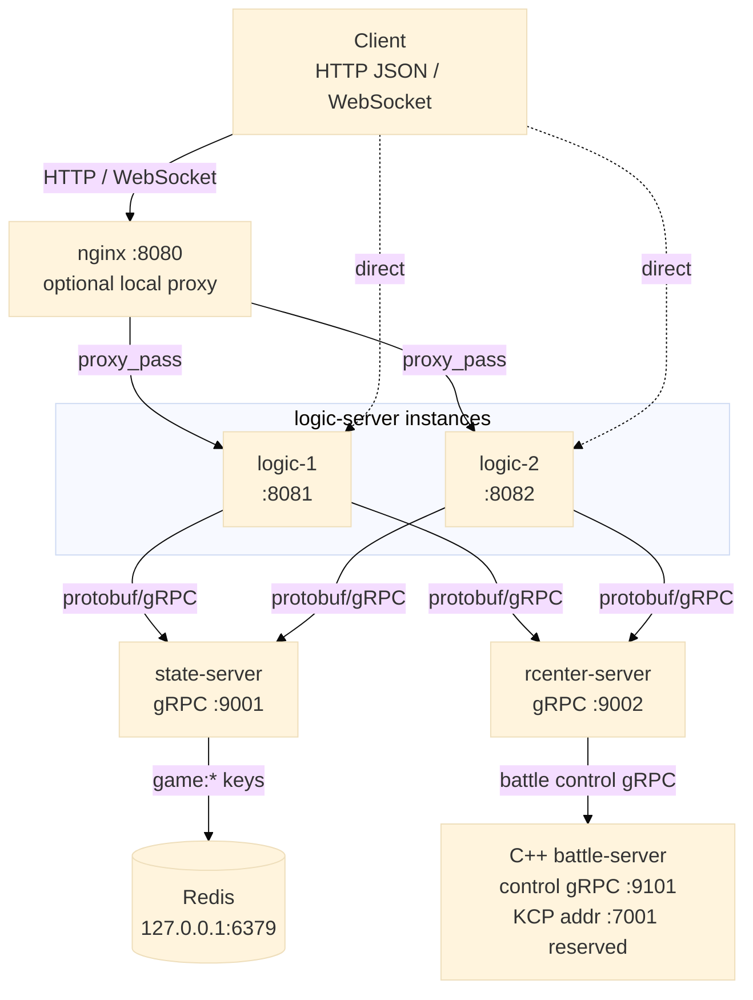
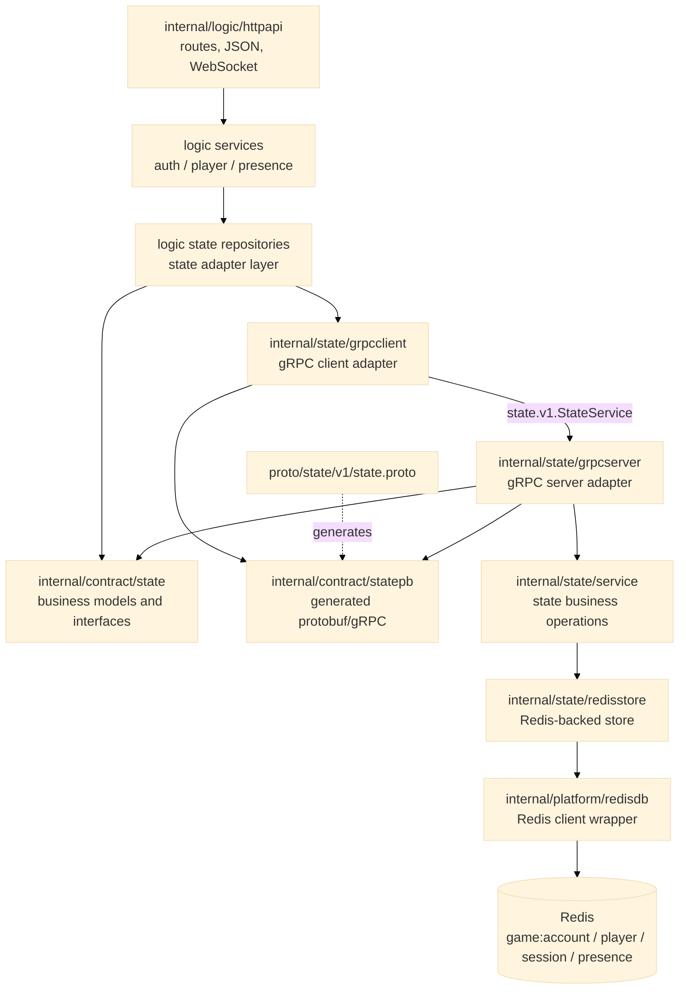
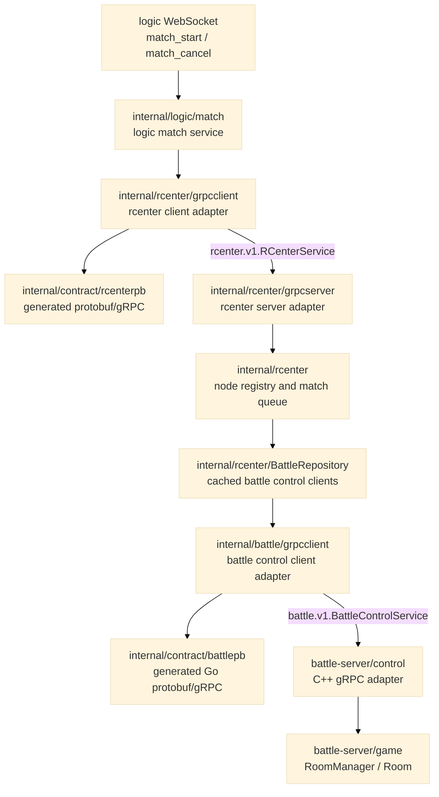

# Architecture

项目正在从单进程 HTTP + Redis demo 迁移成多进程游戏服务器 demo。当前已经完成的核心变化是：`logic-server` 不再直接访问 Redis，而是通过 protobuf/gRPC 调用独立的 `state-server`；匹配和 battle 节点调度进入 `rcenter-server`；C++ `battle-server` 提供房间控制面。

旧的 Go `net/rpc` client/server 适配层已经删除，仓库里只保留当前 gRPC 通信链路。

## Runtime View

当前可运行链路分成三张图：第一张看进程部署关系，第二张看 state 数据链路，第三张看匹配到 battle 控制面的链路。这样在 GitHub、GoLand Markdown Preview 或 Mermaid Live Editor 里不会因为单图过宽导致文字被压得太小。







```text
Client
  |
  | HTTP JSON / WebSocket
  v
nginx (:8080, optional)
  |
  v
logic-server (:8081, logic-1) / logic-server (:8082, logic-2)
  |
  | auth / player / presence service
  v
logic state repository adapter
  |
  | statecontract.Client / statecontract.PresenceClient
  v
state grpcclient
  |
  | protobuf/gRPC, state.v1.StateService
  v
state-server (127.0.0.1:9001)
  |
  | grpcserver adapter
  v
state service
  |
  | accountStore / playerStore / sessionStore / presenceStore
  v
redisstore
  |
  v
Redis (127.0.0.1:6379)
```

```text
Client WebSocket
  |
  | {"type":"match_start"}
  v
logic-server
  |
  | match service
  v
rcenter grpcclient
  |
  | protobuf/gRPC, rcenter.v1.RCenterService
  v
rcenter-server (127.0.0.1:9002)
  |
  | match queue / battle node selection
  v
BattleRepository
  |
  | cached protobuf/gRPC client, battle.v1.BattleControlService
  v
C++ battle-server control (127.0.0.1:9101)
  |
  | create room / join room
  v
RoomManager / Room
```

这条链路的意义是把“客户端入口”和“数据状态操作”拆开：

- `logic-server` 负责 HTTP、WebSocket、认证业务、玩家资料业务和在线状态业务。
- `state-server` 负责状态数据读写和跨数据组合操作。
- `rcenter-server` 负责匹配队列、battle 节点选择和通知 battle-server 创建房间。
- `battle-server` 负责战斗服房间业务，当前先暴露 gRPC control plane。
- Redis 只被 `state-server` 直接访问。
- nginx 只负责本地 demo 的入口代理和 WebSocket upgrade 转发。

## Process Responsibilities

### logic-server

入口：`cmd/logic-server/main.go`

职责：

- 启动 HTTP/WebSocket 服务。
- 注册 `/health`、`/auth/*` 和 `/ws` 路由。
- 创建 `auth.Service`、`player.Service`、`presence.Service` 和 `match.Service`。
- 通过 gRPC 连接 `state-server`。
- 通过 gRPC 连接 `rcenter-server`。
- 使用 `internal/state/grpcclient.Client` 作为 state client。
- 使用 `internal/rcenter/grpcclient.Client` 作为 match client。
- 用 `--name` 标识当前实例，写入 presence 的 `server_name`。

它依赖 state 契约，但不关心 state 的真实存储是 Redis、MySQL，还是别的服务。

### state-server

入口：`cmd/state-server/main.go`

职责：

- 连接 Redis。
- 创建 Redis store。
- 创建 state service。
- 把 state service 注册成 gRPC `StateService`。
- 监听 `127.0.0.1:9001`。

所有跨账号、玩家、会话的组合写操作，都应该尽量放在 `state-server` 内部做成一个粗粒度方法，而不是让 `logic-server` 连续调用多个细粒度 gRPC 方法。

例如注册账号现在使用：

```text
logic auth service
  -> state.RegisterAccount(...)
  -> state-server 内部创建 player、account、session
```

这样比下面这种方式更容易控制并发和一致性：

```text
logic-server
  -> NextPlayerID
  -> CreatePlayer
  -> CreateAccount
  -> CreateSession
```

### nginx

配置：`deploy/nginx/logic.conf`

职责：

- 监听 `:8080`。
- 转发 HTTP 请求到 `127.0.0.1:8081` 和 `127.0.0.1:8082`。
- 保留 WebSocket upgrade 相关 header。

nginx 只属于当前本地 demo 的启动体验，不进入 Go 业务边界。

### rcenter-server

入口：`cmd/rcenter-server/main.go`

当前状态：可运行的匹配和 battle 控制面调度服务。

当前职责：

- 管理 battle-server 注册和负载快照。
- 注册 battle node 时创建并缓存该节点的 control gRPC client。
- 对相同 node name 的重复注册执行替换，并关闭旧连接。
- 维护简单的内存等待队列。
- 为第二个进入队列的玩家创建房间名和 token。
- 选择 active players 最少且未满的 battle node。
- 调用 battle-server `CreateRoom`。
- 把 `room_name`、`token`、`battle_node_name` 和 `battle_kcp_addr` 返回给 logic-server。

当前 rcenter 的状态仍然是内存态；进程重启会丢失注册节点和等待队列。后续如果要做多 rcenter 或高可用，需要把节点心跳、租约和队列状态重新设计成可恢复或可重新注册的模型。

### battle-server

入口：`battle-server/main.cpp`

当前状态：C++ 进程，已实现 battle control gRPC 和房间业务。

当前职责：

- 监听 control gRPC 地址 `127.0.0.1:9101`。
- 实现 `battle.v1.BattleControlService/CreateRoom`。
- 实现 `battle.v1.BattleControlService/JoinRoom`。
- `RoomManager` 用 `mutex + shared_ptr<Room>` 管理房间生命周期。
- `Room` 保存允许进入的玩家列表、房间 token 和已加入玩家集合。

当前还没有实现 UDP/KCP 实时传输层。`kcp_addr` 已经作为调度结果返回给客户端，是下一阶段接入 KCP session 的入口信息。

## Package Layout

```text
cmd/
├── logic-server/
├── state-server/
└── rcenter-server/

proto/
├── battle/v1/battle.proto
├── rcenter/v1/rcenter.proto
└── state/v1/state.proto

internal/
├── battle/
│   └── grpcclient/
├── contract/
│   ├── battlepb/
│   ├── rcenterpb/
│   ├── state/
│   └── statepb/
├── logic/
│   ├── auth/
│   ├── friend/
│   ├── match/
│   ├── player/
│   ├── presence/
│   └── httpapi/
├── platform/
│   ├── config/
│   └── redisdb/
├── rcenter/
│   ├── grpcclient/
│   ├── grpcserver/
│   └── rcenterproto/
└── state/
    ├── grpcclient/
    ├── grpcserver/
    ├── redisstore/
    ├── service/
    └── stateproto/

battle-server/
├── control/
├── game/
├── generated/
└── platform/
```

### internal/contract/state

这是 state-server 对外暴露的共享业务契约。

主要内容：

- `Account`
- `Player`
- `Session`
- `Presence`
- `RegisterAccountInput`
- `RegisterAccountResult`
- `Client` 接口
- `PresenceClient` 接口
- state 级错误，例如 `ErrAccountExists`、`ErrSessionNotFound`、`ErrPresenceNotFound`

`logic-server` 依赖这个接口，不依赖 state-server 的具体实现。

### internal/contract/statepb

这是 `proto/state/v1/state.proto` 生成的 protobuf/gRPC 代码。

主要内容：

- protobuf message。
- `StateServiceClient`。
- `StateServiceServer`。
- gRPC 方法描述。

业务代码不应该直接把 protobuf message 泄漏到 logic 层；protobuf 和业务模型之间的转换放在 `internal/state/stateproto`。

### internal/contract/rcenterpb

这是 `proto/rcenter/v1/rcenter.proto` 生成的 protobuf/gRPC 代码。

主要内容：

- `RCenterServiceClient`
- `RCenterServiceServer`
- `BattleNode`
- `MatchResult`

logic-server 通过 `internal/rcenter/grpcclient` 间接使用它；rcenter-server 通过 `internal/rcenter/grpcserver` 暴露它。

### internal/contract/battlepb

这是 `proto/battle/v1/battle.proto` 生成的 Go protobuf/gRPC 代码。

主要内容：

- `BattleControlServiceClient`
- `CreateRoom`
- `JoinRoom`

Go 侧当前只作为 rcenter 调用 C++ battle-server 的客户端协议；C++ 侧对应生成物放在 `battle-server/generated`。

### internal/logic/auth

认证业务层。

主要职责：

- 校验注册和登录输入。
- 生成 bcrypt 密码哈希。
- 校验密码。
- 生成 session token。
- 调用 state repository 创建账号、会话，或读取账号、会话。
- 把 state 错误转换成 auth 业务错误。

`state_repository.go` 是适配层：它把 auth service 需要的仓储操作转成 `statecontract.Client` 调用。

### internal/logic/player

玩家资料业务层。

当前主要负责：

- 根据玩家 ID 查询玩家资料。
- 把 state player 模型转换成 logic player 模型。

`state_repository.go` 是适配层：它把 player service 需要的仓储操作转成 `statecontract.Client` 调用。

### internal/logic/match

logic 匹配入口。

主要职责：

- 校验 player id。
- 把 WebSocket 上来的 `match_start` 和 `match_cancel` 转成 rcenter 请求。
- 不保存匹配队列，不直接选择 battle node。

当前匹配结果会通过 WebSocket 返回给发起玩家；匹配成功时，logic-server 还会把结果推送给同一个房间里的其他在线玩家。

### internal/logic/presence

在线状态业务层。

当前主要负责：

- WebSocket 建连后标记玩家在线。
- 记录玩家所在 logic-server 实例名。
- WebSocket heartbeat 后刷新仍属于当前实例的在线状态 TTL。
- WebSocket 断开后清理仍属于当前有效连接的在线状态。
- 把 state presence 错误转换成 logic presence 错误。

presence 的默认 TTL 是 2 分钟。连接建立时会写入 TTL，客户端 heartbeat 会调用 `presence.Refresh` 续期。state/Redis 层的 `RefreshPresence` 只在 Redis 中保存的 `server_name` 仍等于当前 logic-server 实例名时刷新 `updated_at` 和 TTL，避免旧连接或旧实例覆盖新连接的在线状态。

### internal/logic/httpapi

HTTP/WebSocket 适配层。

主要职责：

- 定义 HTTP 和 WebSocket 路由。
- 解析 JSON 请求。
- 读取 `Authorization: Bearer <token>`。
- 读取 WebSocket 握手使用的 `token` header。
- 调用 logic service。
- 把业务错误映射为 HTTP 状态码。
- 输出 JSON 响应。
- 在 WebSocket 生命周期里调用 presence service。
- 用本机 `connManager` 记录当前玩家连接 ID、连接时间和最近 heartbeat 时间。

HTTP 层不直接访问 Redis，也不直接调用 generated gRPC client。

WebSocket 当前定义的业务消息：

```json
{"type":"heartbeat"}
```

```json
{"type":"match_start"}
```

```json
{"type":"match_cancel"}
```

收到 heartbeat 后，HTTP 层先调用 `presence.Refresh` 刷新 Redis presence，再更新本机 `connManager` 的 `lastHeartbeatAt`。读循环使用 90 秒 timeout；如果客户端长期不发送消息，连接会退出并触发清理流程。

`connManager` 的删除使用 `connID` 校验。旧连接断开时，如果同一玩家已经在当前 logic-server 上建立了新连接，旧连接的清理不会触发 `presence.MarkOffline`，避免同一个 `server_name` 下误删新连接的 Redis presence。

匹配成功返回 `match_result`，包含 battle-server 的 `room_name`、`token`、`battle_node_name` 和 `battle_kcp_addr`。客户端后续会保留 logic-server WebSocket，同时拿这些字段连接 battle-server 的实时入口。

### internal/state/grpcserver

state-server 使用的 gRPC 适配层。

主要职责：

- 实现 generated `statepb.StateServiceServer`。
- 把 protobuf request 转换成 `statecontract` 模型。
- 调用 `statecontract.Client` 和 `statecontract.PresenceClient`。
- 把 state sentinel error 映射成 gRPC status code。

### internal/state/grpcclient

logic-server 使用的 gRPC 客户端适配层。

主要职责：

- 持有 generated `statepb.StateServiceClient`。
- 实现 `statecontract.Client` 和 `statecontract.PresenceClient`。
- 把 `statecontract` 模型转换成 protobuf request。
- 把 gRPC status error 映射回 state sentinel error。

错误映射很重要，因为 logic 层依赖 `errors.Is` 判断 `statecontract.ErrAccountExists`、`statecontract.ErrSessionNotFound` 等哨兵错误。

### internal/state/stateproto

protobuf message 与 state contract 模型的转换层。

这个包把 `timestamppb.Timestamp`、`durationpb.Duration`、`statepb.Account`、`statepb.Player`、`statepb.Session`、`statepb.Presence` 转成业务模型，避免 protobuf 类型向业务层扩散。

### internal/state/service

state 业务层。

主要职责：

- 暴露账号、玩家、会话和在线状态操作。
- 组合 store 接口，隔离上层与具体存储实现。
- 让 gRPC server 面向统一的 state client。

当前跨资源注册操作已经下沉到 `registrationStore.RegisterAccount`，由 Redis store 用 Redis 事务能力处理冲突。

### internal/state/redisstore

Redis 存储实现。

主要职责：

- 把 state 模型存入 Redis。
- 从 Redis 读取 state 模型。
- 维护 player ID 自增键。
- 用 Redis `WATCH` 和 transaction pipeline 处理账号创建、注册和 presence 清理的冲突。

当前 key 大致包括：

```text
game:account:<username>
game:player:<id>
game:session:<token>
game:presence:<player_id>
game:next_player_id
```

`RegisterAccount` 会检查账号是否存在，生成玩家 ID，写入玩家、账号和 session。玩家 ID 使用 Redis 自增，因此在并发冲突或失败重试时允许出现 ID 空洞。

`ClearPresence` 会先比较 Redis 中保存的 `server_name`，只有它仍然等于当前 logic-server 实例名时才删除 key。`RefreshPresence` 也会先比较 `server_name`，只有 owner 匹配时才更新 `updated_at` 并刷新 TTL。这样可以避免旧连接或旧实例误删、误续同一玩家在新连接上写入的在线状态。

如果以后从 Redis 换成 MySQL，优先新增一个 MySQL store，让它实现 `state/service` 需要的 store 接口。理论上 `logic` 层不应该被影响。

### internal/rcenter

rcenter 业务层。

主要职责：

- 保存已注册 battle node 的内存快照。
- 管理等待匹配的玩家队列。
- 选择未满且 active players 最少的 battle node。
- 通过注入的 `BattleNodeController` 创建 battle 房间。

`StartMatch` 在锁内只做队列和节点选择，不在锁内执行 battle gRPC 调用，避免远程调用阻塞整个匹配队列。

### internal/rcenter/grpcserver

rcenter-server 使用的 gRPC 适配层。

主要职责：

- 实现 generated `rcenterpb.RCenterServiceServer`。
- 把 protobuf request 转成 `rcenter` 业务模型。
- 调用 rcenter service。
- 把 rcenter sentinel error 映射成 gRPC status code。

### internal/rcenter/grpcclient

logic-server 使用的 rcenter gRPC 客户端适配层。

主要职责：

- 持有 generated `rcenterpb.RCenterServiceClient`。
- 提供 `StartMatch`、`CancelMatch`、`RegisterBattleNode` 和 `ListBattleNodes`。
- 把 protobuf `MatchResult` 转回 rcenter 业务模型。

### internal/battle/grpcclient

rcenter 使用的 battle control gRPC 客户端适配层。

主要职责：

- 持有 generated `battlepb.BattleControlServiceClient`。
- 把 rcenter 的 `CreateBattleRoomInput` 转成 battle protobuf request。
- 把 battle protobuf status 转成 Go 侧的 normalized status。

### battle-server/control

C++ battle-server 的控制面适配层。

主要职责：

- 实现 generated C++ `battle::v1::BattleControlService::Service`。
- 把 protobuf request 转成 C++ domain request。
- 调用 `ControlHandler`。
- 把 C++ domain status 转回 protobuf status。

### battle-server/game

C++ battle-server 的房间业务层。

主要职责：

- `RoomManager` 创建、关闭、查询和 join 房间。
- `Room` 校验 token、玩家白名单和重复 join。
- 使用 `mutex` 保护房间表和 join 状态。
- 使用 `shared_ptr<Room>` 避免房间对象在锁外业务处理时悬空。

## Dependency Direction

依赖方向应该保持为：

```text
cmd/logic-server
  -> internal/logic/*
  -> internal/contract/state
  -> internal/state/grpcclient
  -> internal/contract/statepb
  -> internal/rcenter/grpcclient
  -> internal/contract/rcenterpb

cmd/state-server
  -> internal/state/grpcserver
  -> internal/state/service
  -> internal/state/redisstore
  -> internal/platform/redisdb

cmd/rcenter-server
  -> internal/rcenter/grpcserver
  -> internal/rcenter
  -> internal/battle/grpcclient
  -> internal/contract/battlepb

battle-server/control
  -> battle-server/game
  -> battle-server/generated
```

不建议出现：

```text
internal/logic/* -> internal/state/redisstore
internal/logic/* -> internal/platform/redisdb
internal/logic/httpapi -> internal/state/grpcclient
internal/logic/* -> internal/contract/statepb
internal/logic/* -> internal/contract/rcenterpb
internal/rcenter -> battle-server/*
battle-server/game -> battle-server/control
```

原因是 logic 的业务代码应该通过接口表达“我要什么状态能力”，而不是知道 Redis、protobuf 或 gRPC 的细节。

## Error Flow

以重复注册为例：

```text
redisstore
  -> statecontract.ErrAccountExists
state service
  -> statecontract.ErrAccountExists
grpcserver
  -> codes.AlreadyExists
grpcclient
  -> map back to statecontract.ErrAccountExists
logic auth state repository
  -> auth.ErrAccountExists
httpapi
  -> HTTP 409 {"error":"account already exists"}
```

这样做的好处是每一层只暴露自己这一层的错误语义：

- state 层知道 state 错误。
- gRPC 层知道 status code。
- auth 和 presence 层知道自己的业务错误。
- HTTP 层知道状态码和 JSON 错误响应。

## Match And Battle Room Flow

匹配创建房间的当前链路：

```text
Client A
  -> WebSocket {"type":"match_start"}
  -> logic-server
  -> rcenter.StartMatch(playerA)
  -> waiting

Client B
  -> WebSocket {"type":"match_start"}
  -> logic-server
  -> rcenter.StartMatch(playerB)
  -> select battle node
  -> battle.CreateRoom(room_name, token, [playerA, playerB])
  -> matched result
```

客户端收到 matched 后不会断开 logic-server WebSocket。后续设计是客户端继续保留 logic-server 连接，同时拿 `room_name`、`player_id` 和 `token` 去连接 battle-server 的 KCP 入口。

`JoinRoom` 当前通过 battle control gRPC 暴露，主要用于验证业务规则。接入 KCP 后，KCP 会话建立时应该复用相同的 `RoomManager` / `Room` 校验逻辑，而不是在网络层重新写一套房间校验。

## HTTP And gRPC Boundary

当前约定：

- 客户端认证、玩家资料查询和 WebSocket 建连走 logic-server。
- state 数据操作走 state gRPC。
- 匹配入口从 logic WebSocket 进入，资源调度走 rcenter gRPC。
- rcenter 到 battle-server 的房间创建走 battle control gRPC。
- logic 层依赖 `statecontract.Client` / `PresenceClient`，不直接依赖 generated protobuf client。
- battle 实时消息后续走 KCP，不使用 JSON 作为服务器间通信协议。

HTTP 不应该继续膨胀成所有功能入口。新增好友、在线状态查询、匹配、自定义 lobby 等 logic 功能时，可以先在 logic-server 暴露必要 HTTP 接口，但数据读写仍然应该通过 state client 进入 state-server。

## Removed Old Design

这次重构删除或替换了旧设计：

- 删除旧 Go `net/rpc` 契约占位和 client/server 适配层。
- 使用 `proto/state/v1/state.proto` 和 `internal/contract/statepb` 作为当前 gRPC 传输契约。
- 新增 `proto/rcenter/v1/rcenter.proto` 和 `proto/battle/v1/battle.proto`，分别描述 rcenter 调度面和 battle 控制面。
- 使用 `internal/state/grpcclient` 和 `internal/state/grpcserver` 替代旧传输层。
- `scripts/run.sh` 从单 logic-server 启动变成 state-server + 两个 logic-server + 可选 nginx。

更早之前删除的旧单进程结构仍然保持删除状态：

- `cmd/game-server`
- 旧 `internal/httpapi`
- 旧 logic 层 Redis repository
- 旧 `room` HTTP/domain 模块
- 旧 Redis transaction helper

`room` 这个命名之前容易和游戏内房间混淆。后续游戏外玩家自定义开局入口更适合叫 `lobby`；真正游戏内承载可以再根据设计命名为 `game session`、`world` 或 `battle`。当前代码先不提前确定这些模块。
