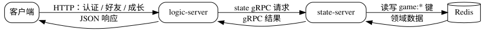
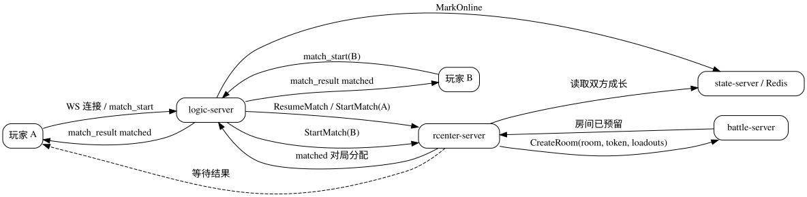
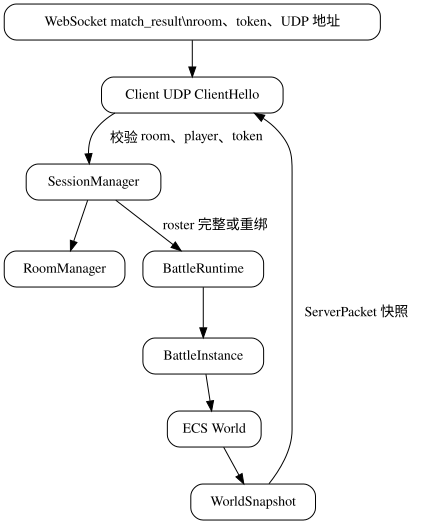
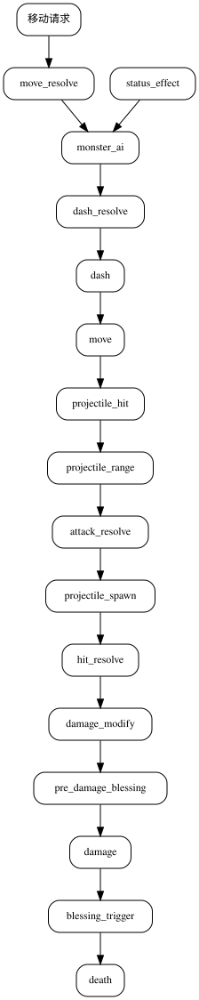
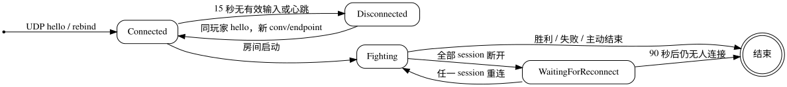

# 架构文档

项目由局外 Go 服务与局内 C++ 战斗服组成。局外侧负责长期玩家状态和对局调度；局内侧负责短生命周期的房间、UDP 会话和确定的 ECS tick。

## 运行拓扑

## 服务职责与状态归属

| 服务 | 职责 | 持久状态 |
| --- | --- | --- |
| `logic-server` | HTTP 健康检查与注册登录、原生 TCP 大厅协议、认证、好友、在线状态、成长和匹配请求适配 | 无业务持久状态；连接仅在本实例内存中 |
| `state-server` | 将局外领域操作映射到持久化存储 | Redis 是当前局外数据来源；MongoDB 已作为后续聊天历史存储预置 |
| `rcenter-server` | battle 节点注册、双人 FIFO 匹配、活跃对局、结算与奖励 | 节点、队列、活跃对局在内存；进程重启会丢失这些状态 |
| `battle-server` | 房间、UDP session、tick、ECS、快照和战斗结束 | 房间和世界在内存；不负责账号和好友 |
| Redis | 账号、玩家、session、成长、金币、好友、在线状态、实时事件 | `game:*` 键 |
| MongoDB | 后续私聊的消息历史、会话摘要与已读游标 | `game-mongo-data` Docker volume；当前未写入业务数据 |

边界规则：

- `logic-server` 不直接读写 Redis 或 MongoDB，只调用 state gRPC 和 rcenter gRPC。
- rcenter 不解析 UDP 包，也不运行 ECS。
- `battle-server/net` 不承载玩法规则；网络事件交给 `session` 和 `runtime`。
- protobuf 源码只在 `proto/`；Go 和 C++ 生成代码由脚本生成。

## 局外逻辑

### 账号、社交与成长

局外成长初始等级均为 1，最高 10：攻击每级 `+8%`、攻速每级 `+6%`、生命每级 `+10%`、移速每级 `+3%`。rcenter 在创建房间前读取所有匹配玩家的成长等级，并连同武器一起传给 battle-server。

成长升级价格由 `internal/logic/growth` 配置，TCP `growth_get` 和 `growth_upgrade` 成功响应均返回每项的当前等级、下一级价格和上限。客户端不应自行推导价格。

### TCP、在线状态与匹配

`rcenter-server` 将第一名玩家放入队列；第二名玩家到来时与队头组成房间。成功创建房间后，为每个玩家写入同一份 `ActiveMatch`，其中包含 `room_name`、token、battle 节点、UDP 地址、玩家列表和局外 loadout。

客户端仅通过 HTTP 注册或登录并取得 session token。logic TCP 完成认证后承载玩家、成长、好友、在线状态和匹配的全部大厅请求，并自动调用 `ResumeMatch`。客户端也可显式发送 `match_resume`，用于从战斗主动返回大厅后重新进入旧对局。没有活跃对局时，恢复会返回 `active match not found`；客户端应清除本地旧 match 并恢复正常匹配。

同一玩家建立新的 TCP 连接时，logic 会替换旧连接并向旧连接推送 `connection_replaced`。好友上线、下线、申请、申请处理和删除好友等实时事件优先投递到本机连接；目标玩家连接在其他 logic 实例时，通过 state 的实时事件通道转发到对应实例。

## 局内逻辑

### 进入房间与战斗数据流

`CreateRoom` 先在 battle-server 建立允许玩家列表和 token。客户端发送 `ClientHello` 后，`SessionManager` 绑定 player、UDP conversation 和 endpoint。房间第一次所有玩家都加入时启动 `BattleInstance`；已存在的玩家使用新的 UDP conversation 或 endpoint hello 时会重绑为同一 session，而不是创建第二个玩家。

客户端的 `ClientInput` 包含移动、攻击和冲刺请求。客户端应每 5 秒发送 `ClientHeartbeat`。battle-server 默认 60 tick/s，并向所有已连接 session 广播 `WorldSnapshot`。

### ECS tick

`World` 使用固定顺序调度系统。顺序是游戏规则的一部分：

系统结果包括：

- 移动、怪物 AI、冲刺、近战和投射物。
- 命中、伤害、死亡、击杀统计和战斗事件。
- 波次生成与玩家经验；每次升级生成 3 个祝福候选。
- 奖励选择阶段暂停正常战斗，所有待选祝福完成或超时自动选择后进入下一波。

快照包含实体位置和生命、波次、阶段、玩家经验、已持有祝福、待选祝福以及短期保留的攻击/死亡事件。

### Loadout、武器与祝福

战斗服在创建玩家实体前先应用武器，再应用局外成长。当前初始武器：

| 武器 | 类型 | 伤害 | 攻击间隔 | 范围 | 附加参数 |
| --- | --- | ---: | ---: | ---: | --- |
| 长剑 | 近战 | 25 | 0.22 秒 | 3.0 | - |
| 匕首 | 近战 | 14 | 0.12 秒 | 2.4 | - |
| 战斧 | 近战 | 40 | 0.45 秒 | 3.5 | - |
| 弓箭 | 投射物 | 30 | 0.30 秒 | 15.0 | 弹速 25，命中半径 0.85 |

当前祝福及每级数值：

| 祝福 | 1 级 | 每级增加 |
| --- | --- | --- |
| 暴击 | 15% 概率，175% 伤害 | 概率 +4%，伤害 +15% |
| 吸血 | 攻击伤害的 8% | +2% |
| 燃烧 | 6 伤害/秒，2.5 秒 | +2 伤害/秒，+0.5 秒 |
| 冰冻 | 15% 概率，1.0 秒 | 概率 +4%，时长 +0.15 秒 |
| 闪电链 | 50% 原伤害、1 个额外目标、距离 9 | 伤害 +10%，额外目标 +1 |

燃烧命中会按现有机制叠加独立状态；数值调整不改变该机制。

## 断线、恢复与房间销毁

`BattleRuntime` 每个 tick 先标记过期 session，再检查房间：

1. 只向 `Connected` session 发送快照和 game over 包。
2. 房间完整 roster 仍保留，用于结束时释放所有玩家，即使部分玩家已断开。
3. 若所有玩家断开，记录首次无人连接的时间。
4. 任一玩家重新 hello 后，清除该房间的无人连接计时。
5. 计时达到 `all_players_disconnected_timeout`（默认 90 秒）时，以 `all_players_disconnected` 结束房间。

战斗结束时，battle-server 调用 rcenter `FinishMatch`。胜利/失败会携带玩家击杀统计并按奖励规则加金币；`all_players_disconnected` 等非胜负原因不携带奖励统计，只释放 `ActiveMatch` 与 in-game 标记，使玩家可以再次匹配。

## 代码导航

| 问题 | 首选位置 |
| --- | --- |
| HTTP 或 TCP 协议 | `internal/logic/httpapi`、`internal/logic/realtime`、`docs/api.md` |
| 匹配、恢复或奖励 | `internal/rcenter`、`internal/logic/match` |
| 局外持久状态 | `internal/state`、`internal/logic/*/*repository.go` |
| Room 与 UDP session | `battle-server/game`、`battle-server/session`、`battle-server/net` |
| Room 生命周期和结束 | `battle-server/runtime` |
| 武器、成长、波次 | `battle-server/gameplay` |
| 局内实体和规则 | `battle-server/ecs`、`battle-server/ecs/design.md` |
