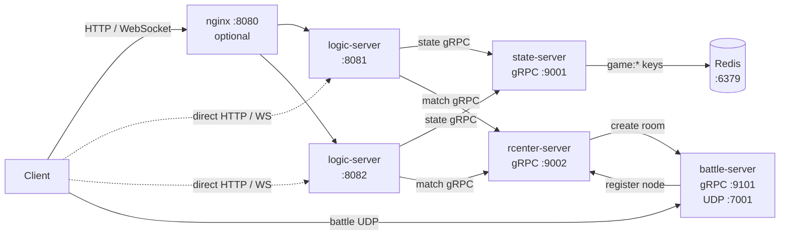
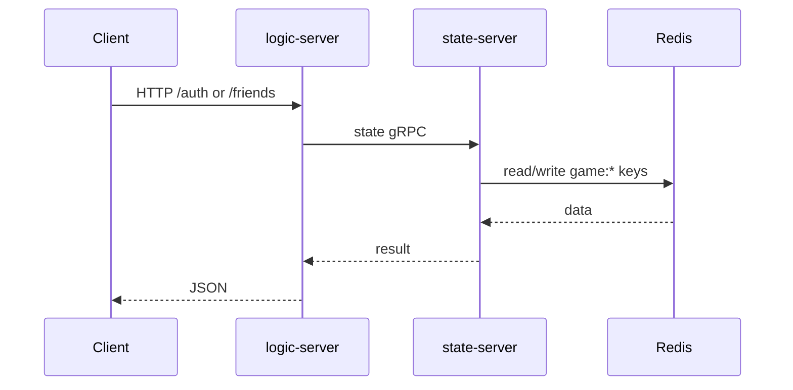
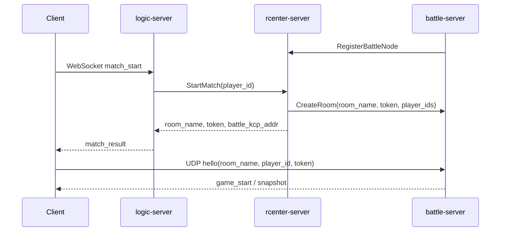
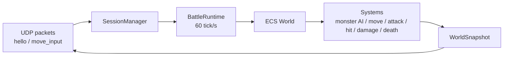

# Architecture

这个项目由 Go 大厅服务和 C++ 战斗服务组成。Go 侧处理账号、好友、在线状态和匹配；C++ 侧处理战斗房间、UDP 会话和局内 ECS。

## Runtime


```mermaid
flowchart LR
    client["Client"]
    nginx["nginx :8080<br/>optional"]
    logic1["logic-server<br/>:8081"]
    logic2["logic-server<br/>:8082"]
    state["state-server<br/>gRPC :9001"]
    rcenter["rcenter-server<br/>gRPC :9002"]
    battle["battle-server<br/>gRPC :9101<br/>UDP :7001"]
    redis[("Redis<br/>:6379")]

    client -->|"HTTP / WebSocket"| nginx
    nginx --> logic1
    nginx --> logic2
    client -.->|"direct HTTP / WS"| logic1
    client -.->|"direct HTTP / WS"| logic2
    logic1 -->|"state gRPC"| state
    logic2 -->|"state gRPC"| state
    state -->|"game:* keys"| redis
    logic1 -->|"match gRPC"| rcenter
    logic2 -->|"match gRPC"| rcenter
    battle -->|"register node"| rcenter
    rcenter -->|"create room"| battle
    client -->|"battle UDP"| battle
```

## Responsibilities

| 模块 | 职责 |
| --- | --- |
| `logic-server` | 对客户端暴露 HTTP/WS；处理认证、好友、在线状态、匹配入口 |
| `state-server` | 对内暴露 state gRPC；统一访问 Redis |
| `rcenter-server` | 保存 battle 节点列表；维护匹配队列；通知 battle-server 创建房间 |
| `battle-server` | 管理房间；校验 UDP hello；接收移动输入；运行 ECS；广播快照 |
| `Redis` | 保存账号、玩家、session、presence、好友和实时事件 |
| `nginx` | 本地代理入口，把请求分发给多个 logic-server |

## Main Flows

登录和好友：


```mermaid
sequenceDiagram
    participant C as Client
    participant L as logic-server
    participant S as state-server
    participant R as Redis

    C->>L: HTTP /auth or /friends
    L->>S: state gRPC
    S->>R: read/write game:* keys
    R-->>S: data
    S-->>L: result
    L-->>C: JSON
```

匹配和进战斗：


```mermaid
sequenceDiagram
    participant C as Client
    participant L as logic-server
    participant RC as rcenter-server
    participant B as battle-server

    B->>RC: RegisterBattleNode
    C->>L: WebSocket match_start
    L->>RC: StartMatch(player_id)
    RC->>B: CreateRoom(room_name, token, player_ids)
    RC-->>L: room_name, token, battle_kcp_addr
    L-->>C: match_result
    C->>B: UDP hello(room_name, player_id, token)
    B-->>C: game_start / snapshot
```

局内 tick：


```mermaid
flowchart LR
    udp["UDP packets<br/>hello / move_input"]
    session["SessionManager"]
    runtime["BattleRuntime<br/>60 tick/s"]
    world["ECS World"]
    systems["Systems<br/>monster AI / move / attack / hit / damage / death"]
    snapshot["WorldSnapshot"]

    udp --> session
    session --> runtime
    runtime --> world
    world --> systems
    systems --> snapshot
    snapshot --> udp
```

## Code Layout

```text
cmd/
├── logic-server/
├── state-server/
└── rcenter-server/

internal/
├── logic/      # auth / friend / match / player / presence / httpapi
├── state/      # grpcserver / grpcclient / service / redisstore
├── rcenter/    # match queue, battle node registry, rcenter gRPC adapter
├── battle/     # Go battle control gRPC client
├── contract/   # generated proto code and shared state contracts
└── platform/   # config and Redis client

battle-server/
├── control/    # C++ battle control gRPC
├── ecs/        # components, systems, world
├── game/       # room domain model
├── gameplay/   # spawn planning
├── net/        # UDP server and packet codec
├── runtime/    # battle instance lifecycle and tick loop
├── session/    # player UDP sessions
└── platform/   # battle-server config

proto/
├── battle/v1/
├── rcenter/v1/
└── state/v1/
```

## Boundaries

- `logic-server` 不直接访问 Redis。
- `state-server` 是 Go 侧唯一直接访问 Redis 的业务进程。
- `rcenter-server` 只处理匹配和 battle 节点调度。
- `battle-server` 不处理账号、好友和 lobby 状态。
- protobuf 定义放在 `proto/`，生成代码放在 `internal/contract/*pb` 和 `battle-server/generated`。
